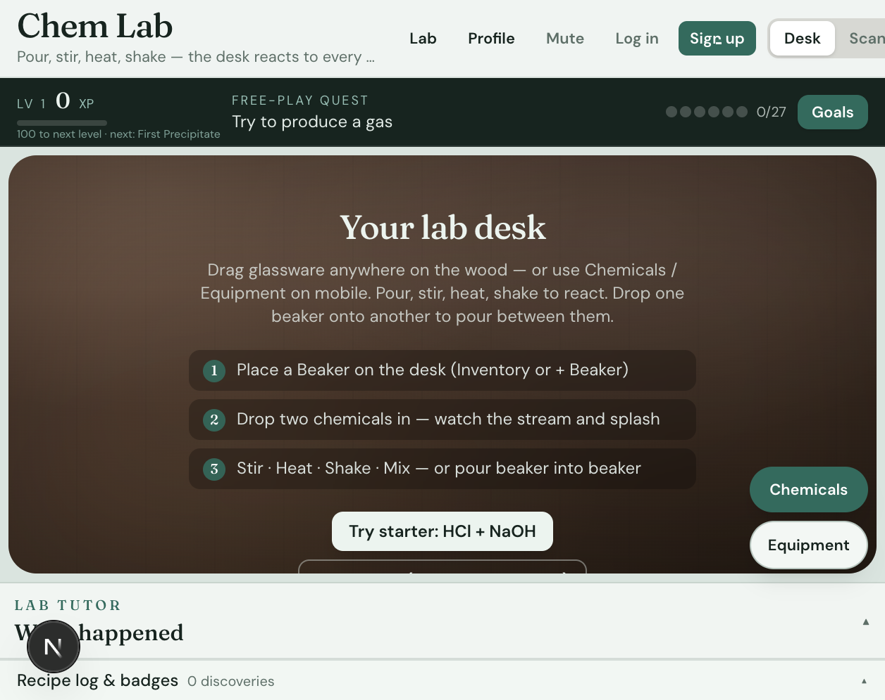
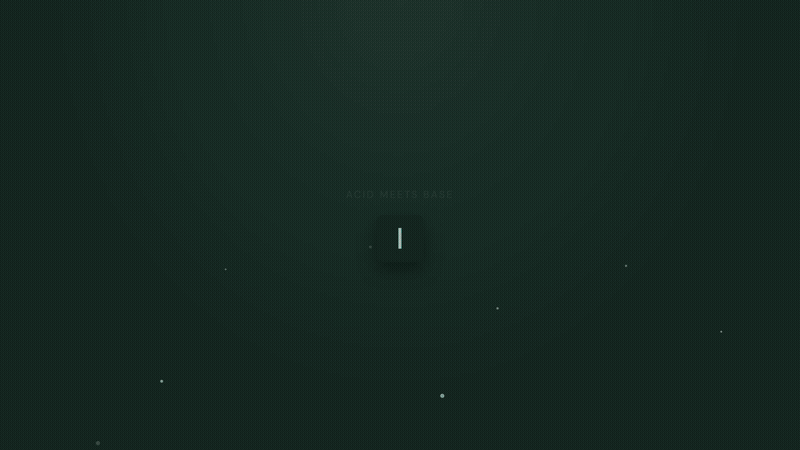
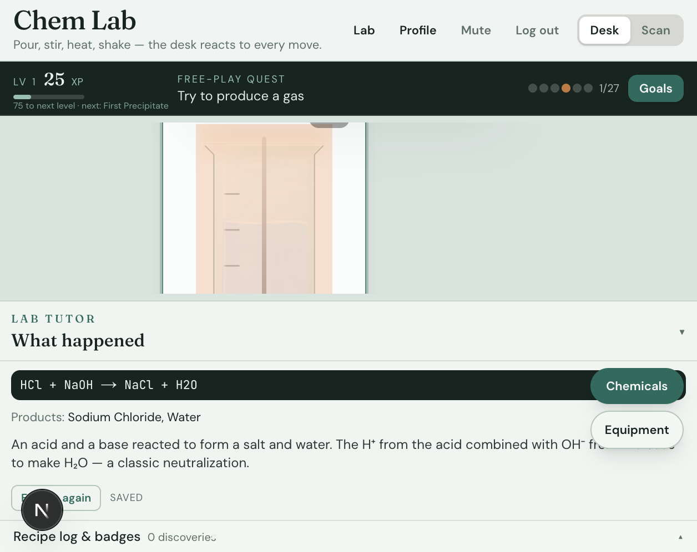

# Alyra Labs

An open-source virtual chemistry laboratory for experiments,
reactions, education, and scientific visualization.

Digital perfume atelier for [ALYRA](https://www.alyra.in/): pour notes, compose formulas, invent signatures on a chemistry desk. Real balanced equations. Plain-language tutor. The desk reacts to every move.

[](./LICENSE)
[](https://alyra-labs.vercel.app)
[](./CONTRIBUTING.md)

**[Live Demo](https://alyra-labs.vercel.app)** · **[Documentation](./DESIGN.md)** · **[Quick Start](#quick-start)** · **[Contributing](./CONTRIBUTING.md)**

<p align="center">
  
</p>

<p align="center">
  
</p>

## Why it exists

Classroom chemistry is usually worksheets and static diagrams. Fragrance design is usually opaque marketing. Alyra Labs sits between them: a tactile desk where you pour, stir, heat, and watch stoichiometry and scent structure resolve in real time — companion to a physical perfume brand, useful as an educational lab, open for anyone to fork.

## What makes it different

- **Tactile first** — drag glassware onto wood; pour streams and vessel FX are first-class, not decoration
- **Real equations** — balanced reaction banners (`HCl + NaOH → NaCl + H2O`), not quiz fluff
- **Perfume atelier** — top / heart / base notes, invent & shelf formulas, market remixes
- **AI tutor + OCR** — plain-language explain; scan a bottle label into the desk
- **MIT open source** — fork it for a class, a brand atelier, or a research demo

## Features

| Feature | What you get |
|---------|----------------|
| Virtual desk | Beakers, pour, stir, heat, cool, shake — phone and desktop |
| Reaction engine | Stoichiometry, hazards, live equation feedback |
| Perfume mode | Note families, IFRA-aware recipes, invention shelf |
| Guided goals | Step-by-step experiments for learning paths |
| AI tutor | Signed-in explain API (Groq) grounded on desk state |
| Teacher CMS | Class codes, progress, soft-launch classroom tools |

<p align="center">
  
  &nbsp;
  
</p>

## Quick start

```bash
git clone https://github.com/Ghost-ops721/alyra-labs.git
cd alyra-labs
cp .env.example .env.local
# Fill Firebase client keys; add GROQ_API_KEY + Firebase Admin for tutor/OCR/progress
npm install
npm run dev
```

Open [http://localhost:3000](http://localhost:3000). Marketing site is `/`; the desk is at `/lab`.

### Required env

| Variable | Where used |
|----------|------------|
| `NEXT_PUBLIC_FIREBASE_*` | Client Auth + Firestore |
| `GROQ_API_KEY` | `/api/explain`, `/api/ocr` |
| `FIREBASE_SERVICE_ACCOUNT_JSON` **or** `FIREBASE_ADMIN_*` | Verify ID tokens; write progress |
| `SENTRY_DSN` / `NEXT_PUBLIC_SENTRY_DSN` | Error tracking (optional) |

Without Admin credentials, the desk UI still runs; AI and progress sync APIs return 503.

### Scripts

```bash
npm run dev          # development
npm run build        # production build
npm run start        # serve build
npm run lint
npm run typecheck
npm test             # Vitest unit tests
npx playwright test  # smoke E2E
```

## Architecture overview

```
src/
  desk/           # Workspace, vessel slots, DnD
  animation/      # Liquid, pour, vessel FX, fluid3d WebGL
  domains/chemistry/  # Engine: reactions, hazards, perfume, goals
  goals/          # Guided experiment progress
  perfume/        # Market / atelier panels
  panel/          # Item inspector
  store/          # Zustand desk + inventory + units
  app/            # Next.js App Router (/, /lab, APIs)
```

- **Client:** Next.js 16 App Router, React 19, Zustand, Tailwind 4, Three.js fluid preview
- **Auth / data:** Firebase Auth + Firestore (`chem-lab-neil`)
- **AI:** Groq via `/api/explain` and `/api/ocr` (token-gated, rate-limited)
- **Design system:** [DESIGN.md](./DESIGN.md) · Brand: [branding/BRAND_BRIEF.md](./branding/BRAND_BRIEF.md)

Deploy checklist: [DEPLOY.md](./DEPLOY.md).

## Roadmap

- [ ] Deeper reaction catalog + more classroom goal packs
- [ ] Contributor docs for adding chemicals / reactions
- [ ] Export / share invention cards for educators
- [ ] Hardening soft-launch teacher CMS for multi-class
- [ ] Optional offline demo mode with fewer Firebase deps

See [open issues](https://github.com/Ghost-ops721/alyra-labs/issues) — look for `good first issue`.

## Contributing

PRs welcome. Read [CONTRIBUTING.md](./CONTRIBUTING.md) and our [Code of Conduct](./CODE_OF_CONDUCT.md).

Labels you will see: `good first issue`, `help wanted`, `documentation`, `beginner`.

## Security notes (soft launch)

- `/api/explain`, `/api/ocr`, and `/api/progress` require a Firebase ID token.
- Rate limits: explain 30/min, OCR 10/min, progress 60/min (per user, in-memory).
- Firestore rules block client writes to `xp` / `discoveredIds` / `badgeIds` — progress goes through `/api/progress`.
- Deploy rules after pulling: `npx firebase-tools deploy --only firestore:rules`

## Auth funnel

Guests can add 2 chemicals, then must sign up. Live tutor and OCR require a signed-in user.

Public marketing lives at `/`. The desk is at `/lab`. Waitlist: `POST /api/waitlist`. Teacher CMS: `/teacher`. Class join: `/join?code=`.

## License

[MIT](./LICENSE) © 2026 Neil Carnac

---

If Alyra Labs helped you, consider giving it a ⭐ so more educators and developers can discover it.

**Maintained by Neil Carnac**
